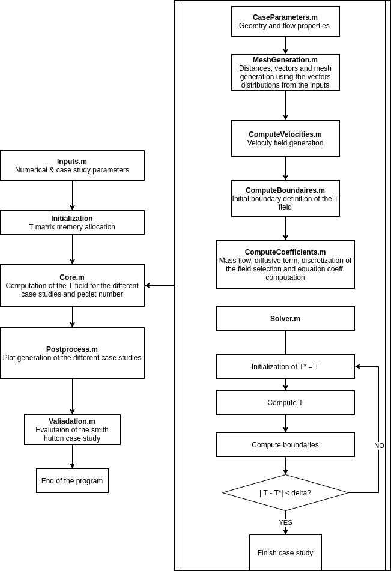
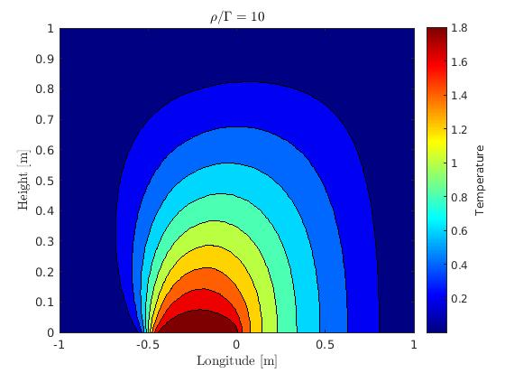
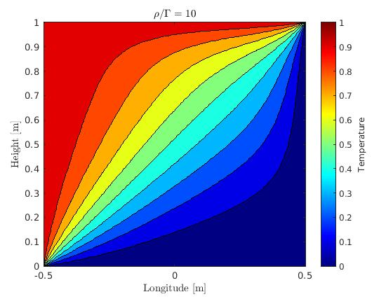
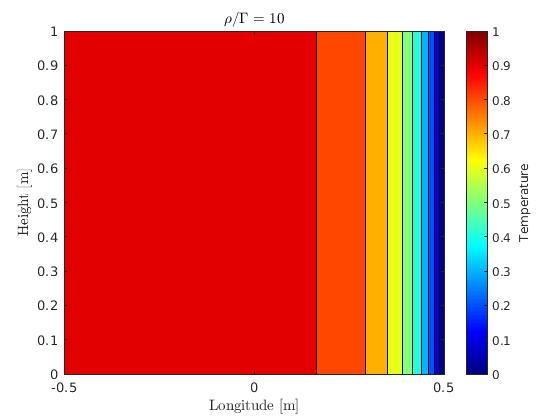

# convection-difussion

This codes develops a flow analyais using the convection-difussion theory. The code developed analaysi three differente main cases:

- A simple channel with unidireccional flow
- A diagonal flow
- The Smith-Hutton case study

## Code report 
---

**Abstract** |  	This report is aimed to provide an introduction to the solution of convection-diffusion problems
using three case studies: parallel & diagonal flow, and the Smith-Hutton case study.

---

The report can be found here in the following link:

<a href="convection_diffusion.pdf" download>Download report</a>

The code structure is described in the following image:

Some of the results you should get when runing the code are:

Please contact me to the following email if you find any mistake ar have any questions regarding the development:

<edgargc.upc@gmail.com>
